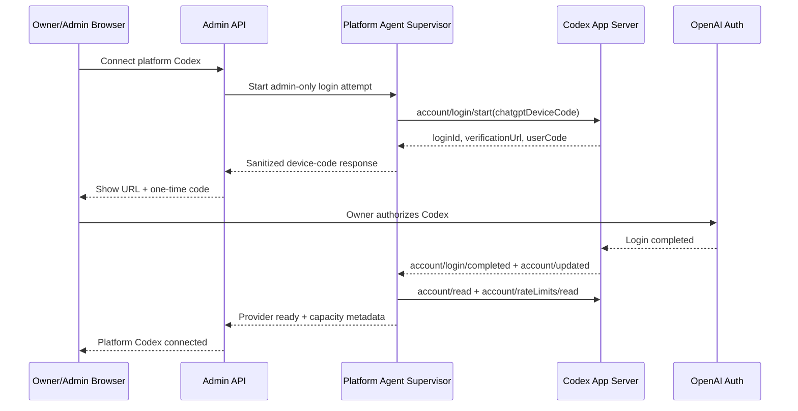
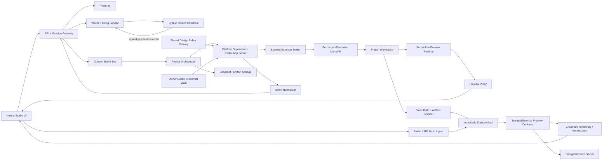

# Plan: Codex Live Web Studio

Status: planning v0.5

Target repository: `D:\Gainers\devcodevibe`

Initial launch: invite-only private beta

Initial generated stack: Vite + React + TypeScript + Tailwind

## 1. Ringkasan keputusan

Produk akan mengubah `devcodevibe` dari website agency dengan demo preview menjadi pengalaman web development nyata:

1. Owner/admin menghubungkan satu akun Codex sebagai credential platform pada saat setup.
2. Pengguna login ke aplikasi tanpa perlu menghubungkan akun Codex sendiri.
3. Sistem mengecek dua gate: kapasitas Codex platform dan saldo Kredit Generate pengguna.
4. Jika saldo tidak cukup, generate dikunci dan pengguna diarahkan membeli paket di Lynk.id.
5. Setelah webhook pembayaran Lynk.id tervalidasi, saldo ditambahkan otomatis.
6. Pengguna membuat project dari starter yang dikurasi dan mengirim prompt.
7. UI menampilkan plan, aktivitas, command, approval, diff, pemakaian, dan sisa saldo secara streaming.
8. File yang benar-benar diubah Codex langsung memperbarui preview interaktif.
9. Pengguna dapat melanjutkan percakapan, melihat history, membuat snapshot, rollback, dan membagikan preview sementara.
10. Profile **Design Quality (Hallmark)** dapat dipilih untuk meningkatkan kualitas visual, lalu hasilnya tetap melewati build, responsive, accessibility, dan content-integrity checks.
11. Preview dibagi menjadi dua: private live preview dengan HMR untuk authoring, serta optional public Cloudflare demo dari immutable static artifact; temporary account harus diklaim dalam 60 menit agar tidak dihapus.
12. Jalur kedua **Drop Website** menerima folder/ZIP static yang sudah jadi, membuatnya live tanpa Codex/KG, lalu menawarkan `Edit with Codex` untuk mengimpor artifact menjadi project berbayar.

Keputusan integrasi utama:

- Gunakan **Codex App Server**, bukan sekadar endpoint completion, karena App Server memang menyediakan authentication, conversation history, approvals, streamed agent events, file changes, dan aggregated diff.
- OAuth Codex hanya milik owner/admin dan dipasang sekali melalui `account/login/start` dengan `type: "chatgptDeviceCode"`. User biasa tidak memiliki endpoint connect/disconnect Codex.
- Jangan menempel token ke source/env aplikasi atau mengunggah `~/.codex/auth.json` melalui UI. Codex App Server mengelola penyimpanan dan refresh credential pada vault/volume khusus platform.
- Jangan gunakan `chatgptAuthTokens` pada MVP karena masih eksperimental dan mengharuskan aplikasi menjadi pemilik lifecycle token.
- Pisahkan OAuth Codex dari saldo user. OAuth adalah credential provider platform; pembelian Lynk.id menghasilkan **Kredit Generate**, bukan token OAuth, OpenAI credit, atau tambahan rate limit Codex.
- Setiap turn harus lolos dua admission gate: saldo Kredit Generate user cukup dan shared Codex pool sedang sehat/tersedia.
- Gunakan direct product link Lynk.id per paket. Tambahkan saldo hanya dari event `payment.received` yang signature-nya valid, terdeduplikasi, dan item UUID-nya dikenal.
- Jalankan App Server via `stdio`. Browser tidak terhubung langsung ke WebSocket App Server karena transport itu saat ini ditandai eksperimental/unsupported.
- Integrasikan Hallmark sebagai **curated, optional design policy pack**, bukan dependency runtime atau marketplace bebas. Vendor snapshot yang sudah direview dan dipin; jangan menjalankan `npx skills add` atau menarik branch `main` dari job user.
- Tambahkan dua jalur Cloudflare: manual `Download ZIP -> Cloudflare Drop` dan automated `wrangler deploy --temporary` yang feature-flagged. Keduanya hanya menerima hasil build statis, bukan raw repository, generated Worker, backend, atau secret.
- Cloudflare temporary demo bukan pengganti authoring preview atau production hosting. Untuk skala multi-tenant/stable hosting, evaluasi permanent platform account + Workers for Platforms.
- UX Drop dibuat provider-agnostic: drag folder/ZIP -> validate -> immutable artifact -> live URL. MVP mewajibkan login untuk publish; guest/no-registration Drop hanya boleh diaktifkan kemudian setelah abuse, legal, rate-limit, dan takedown gate lulus.
- Mulai sebagai private beta. Penggunaan satu akun ChatGPT/Codex owner untuk melayani end user berbayar harus memperoleh konfirmasi terms/entitlement sebelum public launch. Bila tidak disetujui, execution provider berpindah ke platform-owned OpenAI API account tanpa mengubah sistem wallet.

Referensi resmi:

- [Codex App Server](https://developers.openai.com/codex/app-server)
- [Codex authentication](https://developers.openai.com/codex/auth)
- [Codex SDK](https://developers.openai.com/codex/sdk)
- [Agent approvals and security](https://learn.chatgpt.com/docs/agent-approvals-security)
- [Lynk.id payment webhook](https://lynk.id/faq/detail/6908cd80402bd9e753aa85e0-4149-956987938)
- [Lynk.id webhook schema and signature](https://documenter.getpostman.com/view/3211564/2sB2cVf2Kp)
- [Lynk.id pricing](https://lynk.id/pricing)
- [Lynk.id terms](https://lynk.id/terms)
- [Hallmark repository and skill documentation](https://github.com/nutlope/hallmark)
- [Post X yang menjadi referensi Hallmark](https://x.com/yigitakinkaya/status/2075510941131678039?s=20)
- [Cloudflare Drop launch](https://developers.cloudflare.com/changelog/post/2026-07-08-cloudflare-drag-and-drop/)
- [Cloudflare temporary claim deployments](https://developers.cloudflare.com/workers/platform/claim-deployments/)
- [Wrangler deploy command](https://developers.cloudflare.com/workers/wrangler/commands/workers/)
- [Cloudflare Workers for Platforms](https://developers.cloudflare.com/cloudflare-for-platforms/workers-for-platforms/)
- [Cloudflare Terms](https://www.cloudflare.com/policies/terms/)

## 2. Kondisi workspace saat ini

### Fondasi yang dipakai

`devcodevibe` sudah memiliki:

- Next.js 15, React 19, dan TypeScript.
- Landing agency bilingual EN/ID.
- Brand, services, pricing, portfolio, FAQ, journal, lead CTA, dan PostHog.
- SEO/GEO, `llms.txt`, `agent.json`, JSON-LD, OpenAPI, dan Agent CMS.
- Hero dengan prompt, simulasi code streaming, dan preview.

### Gap yang harus ditutup

Preview saat ini belum merupakan website yang dibuat Codex. Model hanya menghasilkan JSON kecil berisi copy/warna/section, kemudian komponen React merender mock preview. Backend `/api/agent` juga masih memakai Anthropic atau fallback statis.

Hero marketing saat ini juga memakai angka contoh di dalam demo preview. Saat landing diaudit dengan Hallmark/content-integrity rules, angka tersebut harus diberi label jelas sebagai data demo atau diganti dengan data nyata; jangan dibiarkan terbaca sebagai bukti pelanggan/hasil produksi.

Belum tersedia:

- Login dan session user.
- Admin-only platform Codex connection dan shared capacity manager.
- Project dan workspace persisten.
- Thread/turn Codex.
- Event streaming.
- File tree dan diff nyata.
- Isolated execution/preview runtime.
- Snapshot dan rollback.
- Queue, quota, rate limiting, billing, serta deployment pipeline.

### POC yang hanya dipakai sebagai referensi UX

- `openclaw-id-zip-build/nextjs` membuktikan pola prompt -> generated HTML -> iframe preview, tetapi credential-nya milik host dan belum multi-tenant.
- `codex-auth-dashboard` adalah diagnostic lokal untuk membaca/menyalin/export `auth.json`. Mekanisme token export/import ini **tidak boleh** dibawa ke SaaS.

## 3. Sasaran produk

### Target pengguna awal

- Founder dan indie hacker.
- UMKM yang membutuhkan landing page.
- Marketer/non-developer yang ingin melakukan iterasi visual dengan prompt.

### Janji produk

“Deskripsikan website, lihat Codex mengubah file sungguhan, lalu coba hasilnya saat itu juga.”

### North-star metric

Median waktu dari prompt pertama sampai preview yang usable.

Metrik pendukung:

- Platform Codex availability, auth health, dan refresh success rate.
- Median provisioning time.
- Turn completion rate.
- Preview/build success rate.
- Persentase turn yang membutuhkan approval atau rollback.
- Median waktu HMR setelah file berubah.
- Payment-to-credit latency Lynk.id.
- Persentase webhook yang masuk `unclaimed` atau perlu rekonsiliasi.
- Kredit Generate purchased, reserved, consumed, dan released.
- Shared Codex capacity availability dan median queue time.
- Static export success, temporary publish success, median publish latency, dan provider throttling rate.
- Retention project pada hari ke-1 dan hari ke-7.

## 4. Scope MVP

### Termasuk MVP

- Login aplikasi.
- Admin-only setup, status, refresh, dan disconnect OAuth Codex platform.
- Wallet dan saldo Kredit Generate per user/tenant.
- Paket Kredit Generate dengan direct checkout URL Lynk.id.
- Webhook Lynk.id dengan signature validation, idempotency, product mapping, dan durable credit posting.
- Halaman payment pending, saldo otomatis terbarui, serta flow unclaimed purchase.
- Quote, hold/reservation, actual debit, dan release per Codex turn.
- Hard stop ketika saldo tidak cukup, dengan CTA pembelian Lynk.id.
- Shared Codex capacity guard, fair queue, concurrency limit, dan circuit breaker.
- Project CRUD dari satu starter terkurasi.
- Prompt/chat multi-turn.
- Streaming plan dan activity timeline.
- Command/file-change events yang aman ditampilkan.
- Approval untuk command, network, atau file change yang memerlukannya.
- Live preview iframe dengan HMR.
- Desktop/tablet/mobile viewport selector.
- File tree read-only dan unified diff per turn.
- Stop, retry, dan follow-up prompt.
- Build validation.
- Optional `Design Quality (Hallmark)` profile untuk build/redesign, dengan version pin, usage estimate, dan audit result yang terlihat.
- Read-only design audit setelah generation: responsive, accessibility dasar, token consistency, generic-AI-pattern checks, serta larangan membuat metrik/testimoni/logo pelanggan yang tidak diberikan user.
- Snapshot otomatis setelah turn sukses.
- Rollback ke snapshot sebelumnya.
- Preview share URL yang private, revocable, dan memiliki expiry.
- Download ZIP dari immutable static build artifact.
- Authenticated Drop Website: folder/ZIP static prebuilt -> scan -> live preview, tanpa KG.
- Optional owner-triggered **Cloudflare Demo — Claim dalam 60 Menit** pada public `workers.dev`, termasuk estimated claim-deadline countdown dan sensitive claim-link reveal.
- Quota CPU, RAM, disk, process, bandwidth, durasi turn, dan concurrency.
- Auth expiry, usage limit, build error, dan runtime disconnect states.

### Bukan MVP

- Banyak framework atau arbitrary Dockerfile.
- Backend/database yang dibuat bebas oleh agent.
- Secret injection ke generated app.
- Production deployment otomatis.
- Permanent Cloudflare hosting, custom-domain provisioning, atau update deployment setelah user melakukan claim.
- Generated Worker code, SSR, server actions, KV, D1, Durable Objects, Queues, bindings, atau secret pada Cloudflare temporary demo.
- Custom domain.
- Kolaborasi real-time multi-user.
- Full browser IDE.
- Plugin marketplace.
- Runtime install/auto-update Hallmark atau skill pihak ketiga dari internet.
- Hallmark `study URL` dengan unrestricted network fetch; MVP hanya menerima referensi yang di-upload atau URL yang sudah melalui fetch proxy aman.
- Figma import.
- Dynamic backend preview atau background worker.
- Public anonymous generation.
- Unrestricted anonymous public file hosting. Guest Drop tanpa registrasi hanya kandidat feature-flagged setelah Turnstile/proof-of-work, abuse scanning, per-IP quota, takedown, dan legal gate lulus.
- Recurring subscription atau auto-debit.
- Checkout/order creation API yang tidak didokumentasikan Lynk.id.
- Otomatisasi refund/chargeback penuh sebelum event/API resminya tersedia.

## 5. UX yang direncanakan

### Information architecture

- `/` dan `/id`: marketing site yang sudah ada.
- `/studio`: daftar project dan onboarding.
- `/studio/new`: pilih starter dan buat project.
- `/studio/[projectId]`: workspace prompt-to-preview.
- `/studio/[projectId]/deployments`: static exports, private shares, Cloudflare temporary demos, expiry, dan claim handoff.
- `/drop`: drag folder/ZIP static prebuilt, local manifest preview, upload progress, scan result, lalu live URL; MVP meminta login sebelum publish.
- `/settings/billing`: saldo, paket, riwayat transaksi, dan payment pending.
- `/billing/return`: kembali dari Lynk.id dan menunggu verifikasi webhook; halaman ini bukan bukti pembayaran.
- `/admin/integrations/codex`: admin-only health, rate limit, connect, refresh, dan disconnect.
- `/admin/billing`: webhook health, unclaimed purchase, refund/chargeback, dan rekonsiliasi.
- `/p/[shareId]`: expiring shared preview pada origin preview terpisah.

### Layout workspace desktop

```text
+-------------------------------------------------------------------+
| Project | Platform ready | Credits | Viewport | Refresh | Share v | History |
+--------------------------+----------------------------------------+
| Conversation / Activity  |                                        |
|                          |             LIVE PREVIEW               |
| plan                     |                                        |
| command                  |                                        |
| file changes             |                                        |
| approval cards           |                                        |
|                          |                                        |
| [ follow-up prompt ... ] |                                        |
+--------------------------+----------------------------------------+
| Changes | Files | Build | Logs                                    |
+-------------------------------------------------------------------+
```

Mobile memakai tab `Chat`, `Preview`, dan `Changes`, bukan tiga panel sekaligus.

### State yang wajib terlihat

- Connecting Codex.
- Platform Codex ready/unavailable; hanya terlihat sebagai status layanan bagi user.
- Saldo cukup / saldo tidak cukup.
- Menunggu pembayaran Lynk.id.
- Pembayaran diterima / Kredit Generate ditambahkan.
- Pembelian belum terhubung ke akun (`unclaimed`).
- Provisioning workspace.
- Planning.
- Editing files.
- Installing dependencies.
- Testing/building.
- Needs approval.
- Preview updating.
- Preview ready.
- Folder/ZIP reading, upload, server validation, scanning, dan artifact ready.
- Static source rejected: missing `index.html`, source project belum di-build, zip bomb/path traversal, secret, atau unsupported backend.
- Static artifact building/scanning.
- Cloudflare temporary demo deploying/ready/temp-window-ended/provider-limited.
- Public preview warning dan estimated 60-minute claim countdown; setelah claim URL dapat tetap hidup.
- Turn failed / retry available.
- Auth expired / reconnect.
- Shared Codex rate limit reached / queued; tidak menampilkan CTA beli kredit.
- Generation credit limit reached; menampilkan CTA beli di Lynk.id.

UI tidak menampilkan raw chain-of-thought. Yang ditampilkan adalah plan, ringkasan aktivitas, command yang relevan, diff, output build, dan final summary.

### Design quality profile

- Project memakai profile `Base` secara default; `Design Quality (Hallmark)` tersedia sebagai opt-in pada private beta sampai benchmark kualitas, latency, dan KG selesai.
- Sebelum generate, quote menampilkan estimasi KG profile tersebut. Self-critique/revisi internal Hallmark tetap bagian dari satu turn dan diselesaikan dari actual usage turn yang sama, bukan debit tersembunyi per revisi.
- `Audit` berjalan read-only dan menghasilkan findings terstruktur; `Build`/`Redesign` boleh menulis hanya di workspace project setelah file plan terlihat di activity timeline.
- `Study` dari screenshot/upload dapat ditambahkan setelah sanitasi. `Study` dari URL tetap feature-flagged sampai SSRF, copyright, dan hostile-page handling lulus.
- Hallmark membantu taste dan consistency, tetapi tidak mengalahkan system policy, sandbox, approval, budget, content integrity, atau acceptance gate platform.

### Completion card per turn

- Ringkasan hasil.
- Jumlah file berubah.
- Build status.
- Link “Lihat perubahan”.
- Tombol rollback.
- Menu share: private revocable link, `Download ZIP & Open Cloudflare Drop`, atau automated public Cloudflare demo dengan claim window 60 menit.
- Saran prompt lanjutan, misalnya “perbaiki mobile” atau “tambahkan section testimoni”.

## 6. OAuth Codex milik platform

### Identity boundary

1. **App identity**: setiap user memiliki login, project, role, wallet, dan riwayat sendiri.
2. **Platform Codex identity**: satu OAuth Codex milik owner/admin yang dipakai agent supervisor sebagai shared provider connection.

User biasa tidak melihat OAuth flow, tidak memiliki `codex_connection`, dan tidak bisa connect/disconnect provider. Mereka hanya melihat status layanan: `available`, `queued`, atau `temporarily unavailable`.

### Admin bootstrap flow



### Credential rules

- Admin melakukan OAuth sekali melalui flow resmi; user biasa tidak pernah menerima auth URL atau token.
- Raw access/refresh token tidak pernah dikirim ke browser user atau disimpan sebagai field biasa di database.
- Codex App Server mengelola token pada encrypted credential vault/volume milik platform.
- Control plane hanya menyimpan provider connection id, auth mode, health, rate-limit metadata, dan timestamps.
- Jangan memasukkan token ke project workspace, generated command environment, preview runtime, snapshot, artifact, telemetry, atau error response.
- Hanya admin role yang dapat memulai login, refresh, logout, atau revoke.
- Redact pola token dan secret di semua log dan crash dump.
- Jangan menjalankan lebih dari satu credential owner yang dapat melakukan refresh secara bersamaan sebelum rotation/concurrency behavior tervalidasi.

### Shared capacity rules

- Semua user berbagi rate limit dan entitlement dari akun Codex owner.
- `account/rateLimits/read` menjadi input admission controller global, bukan saldo user.
- Pembelian Kredit Generate tidak menambah atau mereset shared Codex quota.
- Saat shared quota/capacity habis, request diberi status `PLATFORM_CODEX_CAPACITY_UNAVAILABLE`, diantrekan atau diminta mencoba lagi. Kredit user tidak dipotong dan tidak ada CTA top-up.
- Saat OAuth expired, statusnya `PLATFORM_CODEX_AUTH_REQUIRED` dan hanya admin yang menerima action reconnect.
- Gunakan global concurrency cap, fair queue per user, reset time, circuit breaker, dan kill switch agar satu user tidak menghabiskan seluruh kapasitas.

### Production terms gate

Codex App Server mendukung embedding Codex ke dalam aplikasi secara teknis. Namun memakai satu subscription/OAuth ChatGPT owner untuk melayani user berbayar bukan alasan untuk menganggap model komersialnya otomatis disetujui. Sebelum public launch, minta konfirmasi tertulis dari OpenAI atau gunakan platform-owned API/business account. Sistem wallet dan Lynk.id tetap sama jika provider autentikasi harus diganti.

## 7. Kredit Generate dan Lynk.id

### Terminologi

- **OAuth Codex**: credential provider milik owner/admin; tidak dijual kepada user.
- **Kredit Generate (KG)**: saldo aplikasi yang dibeli user melalui Lynk.id dan dipakai untuk menjalankan Codex turn.
- **Shared Codex quota**: kapasitas/rate limit akun owner; terpisah dari KG.
- **Generation token equivalent**: unit metering internal untuk menjelaskan pemakaian KG; bukan OpenAI credit dan tidak menambah entitlement OpenAI.

Copy UI harus memakai “Beli Kredit Generate”, bukan “Beli token OAuth Codex”.

### Unit dan paket

Rekomendasi awal:

- `1 KG = 1.000 weighted metered tokens` pada rate card yang dipin ke setiap turn.
- UI dapat menjelaskan `100 KG ≈ 100.000 generation-token equivalent` dan memberi estimasi jumlah turn berdasarkan histori, bukan menjanjikan jumlah website tertentu.
- Semua nilai disimpan sebagai integer `microcredit`, tidak memakai floating point.
- Contoh konfigurasi awal, dengan harga IDR ditentukan setelah M0 cost/margin test:

| Package code | Kredit Generate | Token equivalent | Harga |
|---|---:|---:|---:|
| `STARTER` | 100 KG | 100.000 | TBD |
| `BUILDER` | 500 KG | 500.000 | TBD |
| `PRO` | 1.500 KG | 1.500.000 | TBD |

Setiap package dipetakan server-side ke satu `items[].uuid` dan direct product URL Lynk.id. Jangan memetakan paket berdasarkan judul produk yang dapat berubah.

Harga paket dihitung dari target token allowance, runtime/preview cost, support, fraud/refund reserve, fee dan pajak Lynk.id, serta margin. Fee Lynk.id bergantung tier dan dapat berubah, sehingga disimpan sebagai pricing configuration dan direkonsiliasi dari transaksi nyata; jangan di-hardcode ke rumus ledger.

Rate card berversi dapat membedakan uncached input, cached input, output/reasoning, tool calls, dan runtime bila datanya tersedia. Perubahan rate card tidak berlaku retroaktif pada quote/turn yang sudah dibuat.

M0 wajib membuktikan bahwa `thread/tokenUsage/updated` memberikan delta usage per turn yang authoritative, tidak double count, dan cukup cepat untuk hard cap. Jika tidak, jangan menjual billing berbasis token. Gunakan paket turn fixed-budget seperti Quick/Standard/Complex atau pindah ke API provider dengan usage metering authoritative.

Profile Hallmark menambah prompt context dan dapat melakukan self-critique/revisi, sehingga quote harus memiliki budget profile tersendiri. M0 membandingkan Base vs Hallmark untuk median input/output usage, latency, build-success, dan design-audit score. Harga atau multiplier Hallmark tidak boleh ditetapkan sebelum data benchmark tersedia.

Static export atau publish dari snapshot yang sudah ada tidak menjalankan Codex dan tidak memotong KG. Gunakan `temporary_publish_allowance`, per-user/IP rate limit, concurrency limit, dan provider circuit breaker terpisah. Jika artifact membutuhkan perbaikan Codex, user menerima quote/hold KG baru; deploy failure, Cloudflare proof-of-work, throttling, atau expiry tidak pernah mengurangi KG.

### User purchase flow

```mermaid
sequenceDiagram
    participant U as User
    participant APP as Studio App
    participant L as Lynk.id Checkout
    participant WH as Lynk Webhook
    participant W as Credit Ledger

    U->>APP: Select credit package
    APP-->>U: Open direct Lynk.id product URL
    Note over U,L: User must use the same verified email
    U->>L: Complete payment
    L->>WH: payment.received + X-Lynk-Signature
    WH->>WH: Verify signature, event, UUID, refId, message_id
    WH->>W: Post PURCHASE_CREDIT once
    W-->>APP: Balance updated event
    APP-->>U: Credits available; composer unlocked
```

Karena dokumentasi publik Lynk.id belum menunjukkan Checkout API, custom order metadata, polling payment API, atau browser `success_url`, MVP memakai direct hosted checkout URL. Browser return, screenshot, atau email pelanggan tidak pernah menjadi bukti pembayaran.

### Email matching dan unclaimed purchase

- User harus checkout memakai email terverifikasi yang sama dengan akun aplikasi.
- Webhook mencocokkan `customer.email` yang sudah dinormalisasi ke satu user.
- Jika tidak cocok, transaksi disimpan sebagai `UNCLAIMED`; kredit tidak hilang dan tidak diberikan ke akun sembarang.
- Claim membutuhkan `refId` plus verifikasi ke email pembeli atau verifikasi admin terhadap dashboard Lynk.id. Mengetik `refId` saja tidak cukup.
- Custom message Lynk.id dapat berisi link “Kembali ke aplikasi”, tetapi link itu hanya membantu UX dan bukan payment confirmation.

### Webhook verification

Endpoint `POST /api/webhooks/lynkid` wajib:

1. Membatasi ukuran body dan hanya menerima JSON `POST`.
2. Mengambil `X-Lynk-Signature`.
3. Menghitung `SHA256(grandTotal + refId + message_id + merchantKey)` menggunakan representasi nilai yang ditentukan Lynk.id.
4. Membandingkan signature secara timing-safe.
5. Memastikan `event = payment.received`, `message_action = SUCCESS`, dan `message_code = 0`.
6. Memastikan setiap product UUID aktif dan sesuai mapping package server-side.
7. Menyimpan `message_id`, `refId`, payload hash, product UUID, quantity, email, dan amount.
8. Memakai unique constraint pada provider event dan transaction reference agar retry tidak menggandakan saldo.
9. Membalas `200` dengan cepat lalu melakukan durable ledger posting lewat queue/outbox.

Credit amount berasal dari `product UUID -> KG` dikali quantity, bukan dari `grandTotal`. `grandTotal` dipakai untuk signature dan rekonsiliasi karena dapat mencerminkan fee/discount.

### Credit ledger dan hard stop

Ledger bersifat append-only dan memakai flow:

```text
Order: CREATED -> PENDING_PAYMENT -> PAYMENT_CONFIRMED -> CREDITED
Turn:  QUOTED -> RESERVED -> RUNNING -> SETTLING -> SETTLED
Hold:  ACTIVE -> CAPTURED/PARTIALLY_CAPTURED + remainder RELEASED
```

Saat user menekan Generate:

1. Server membuat quote berisi `pricing_version`, estimated range, `max_credit`, dan expiry.
2. Dalam satu transaction/row lock, server menghitung `available = posted_balance - active_holds`.
3. Sistem membuat credit hold dan global provider-capacity lease.
4. Worker hanya mulai setelah kedua reservation berhasil.
5. Pada 80% dan 95% cap, UI menampilkan warning; mendekati 100%, supervisor melakukan graceful interrupt dengan safety buffer.
6. Setelah selesai, actual usage dicapture dan sisa hold dilepas.

Jika saldo tidak cukup, API mengembalikan `INSUFFICIENT_GENERATION_CREDIT` dan checkout URL Lynk.id. Project, preview, files, history, dan export tetap bisa dibuka; hanya composer/generate yang dikunci.

### Settlement rules

- Gagal sebelum provider menerima job, auth rejection, rate-limit rejection, atau provisioning error: release 100% hold.
- User menghentikan turn: capture actual usage, release sisanya.
- Turn memakai token tetapi build akhirnya gagal: capture actual usage; kompensasi karena platform error dicatat sebagai `GOODWILL_CREDIT`, bukan menghapus debit.
- Retry biasa membuat turn dan hold baru. Recovery replay untuk job yang sama harus memakai idempotency key yang sama.
- Ongoing turn tidak boleh membelanjakan lebih dari reservation; interrupt bila hard cap tercapai.

### Refund dan chargeback

- Setiap purchase membuat credit lot terkait order dan dikonsumsi FIFO.
- Paid credits tidak kedaluwarsa pada MVP; bonus/promo boleh punya expiry hanya jika disclosure-nya jelas.
- Refund menarik paid credit yang belum terpakai/ter-hold dan mencatat `REFUND_REVERSAL`.
- Chargeback selalu append-only. Jika kredit sudah dipakai, wallet dapat menjadi negatif/frozen dan membutuhkan review admin.
- Dokumentasi publik Lynk.id saat ini hanya menunjukkan `payment.received`, bukan refund/chargeback event. Private beta memerlukan rekonsiliasi admin dan konfirmasi lebih lanjut ke support Lynk.id.
- Simpan bukti fulfillment saat credit posting berhasil karena terms Lynk.id menempatkan tanggung jawab delivery produk/layanan pada creator.

## 8. Arsitektur target



### Control plane

Tanggung jawab:

- Login aplikasi dan authorization.
- Project metadata dan membership.
- Wallet, Lynk.id payment state, quote, hold, ledger, dan reconciliation.
- Queueing, shared provider capacity, user quota, dan lifecycle runtime.
- Mapping project -> runner -> Codex thread.
- Sanitized event streaming ke browser.
- Audit trail dan abuse controls.

### Provider supervisor dan agent plane

- Satu platform supervisor menjadi pemilik OAuth credential dan menjalankan Codex App Server melalui `stdio`.
- Credential owner tidak disalin ke setiap tenant runner atau workspace.
- Generated commands dieksekusi melalui sandbox broker pada isolated microVM per active project.
- Gunakan schema yang di-generate dari versi Codex CLI yang dipin.
- App Server memakai `workspaceWrite` dengan readable/writable root hanya project.
- Network default-off; akses package registry hanya pada setup/install policy yang eksplisit.
- Generated command berjalan sebagai user non-root dengan CPU/RAM/PID/disk/time limits.
- Tidak ada host mount, Docker socket, host PID/network, device host, ptrace, atau cloud credential.
- M0 harus memvalidasi bahwa App Server credential ownership, external sandbox boundary, thread concurrency, dan refresh token tidak mengalami race. Jika boundary ini tidak dapat dibuat aman, pindahkan provider ke API/business architecture.

### Curated design policy layer

- Hallmark adalah instruction/policy pack untuk meningkatkan design judgment; ia bukan model, renderer, sandbox, atau security boundary baru.
- Baseline private-beta dipin ke Hallmark `v1.1.0` pada commit `aeb42fb354ff4efa36ab475773a082315a3af2ce`, lalu disalin ke catalog internal dengan namespace/version sendiri.
- Bundle yang dipromosikan harus menyertakan MIT license notice, manifest file + SHA-256, hasil scan, reviewer, dan tanggal promotion. Upgrade dilakukan manual melalui reviewed diff, bukan auto-pull.
- Hanya `SKILL.md` dan reference yang dibutuhkan yang dimuat secara lazy untuk membatasi context/token overhead.
- Instruksi pihak ketiga diperlakukan sebagai untrusted policy input. System policy platform selalu lebih tinggi; skill tidak mendapat credential OAuth, merchant key, host filesystem, private network, atau kemampuan menambah authority.
- Side effect seperti `.hallmark/*`, `design.md`, token file, atau preview helper hanya boleh berada di workspace project, harus muncul di diff, dan dapat dinonaktifkan oleh profile internal.
- Jika policy pack gagal dimuat atau output melanggar schema/budget, turn jatuh kembali ke Base atau berhenti dengan alasan jelas; jangan mengunduh versi baru saat runtime.

### Authoring preview plane

- Preview runtime dipisahkan dari agent runtime dan tidak menerima credential Codex.
- Initial stack dibatasi ke Vite + React + TypeScript + Tailwind.
- File watcher memicu HMR setelah perubahan workspace yang valid.
- Build yang gagal tidak menggantikan last-known-good preview.
- Preview berada pada eTLD+1 berbeda dari dashboard, misalnya dashboard `app.example.com` dan preview `*.preview-example.net`.
- Gunakan iframe sandbox, CSP ketat, exact-origin `postMessage`, cookie HostOnly, dan signed preview URL.
- Origin unik per build mencegah localStorage/service worker terbawa lintas tenant atau versi.

### Drop Website intake

- Browser dropzone menerima folder melalui directory picker/drop API atau satu ZIP. File tree dan total size dihitung lokal untuk early feedback, tetapi server mengulang seluruh validation; client manifest tidak dipercaya.
- Upload memakai short-lived presigned multipart/object-storage URL sehingga file besar tidak melewati long-running Next.js request. Session diikat ke actor/IP, TTL, quota, dan idempotency key.
- Input harus **prebuilt static output** dengan root `index.html`: HTML, CSS, client-side JavaScript, image, dan font. Folder source React/Vite/Next dengan `package.json` tetapi tanpa build output tidak otomatis dijalankan; UI meminta user drop `dist/`/`out/` atau memilih `Build/Edit with Codex`.
- ZIP diekstrak dalam no-secret ingest microVM dengan compressed/uncompressed size, compression-ratio, nesting, file-count, path-length, symlink, device-file, absolute-path, `..`, Unicode-confusable, dan MIME limits untuk mencegah zip bomb/path traversal.
- Artifact yang lulus mendapat manifest/hash dan dapat diteruskan ke private preview atau automated Cloudflare temporary provider tanpa Codex/KG.
- `Edit with Codex` membuat project baru dari sanitized artifact, menyimpan provenance, lalu mengikuti app login, wallet, quote, hold, dan turn rules normal. Import sendiri 0 KG; turn Codex pertama memakai KG.
- MVP publish membutuhkan authenticated user. Guest/no-registration mode memakai anonymous short-TTL session saja, tidak membuat project/history, dan tetap membutuhkan consent, Turnstile/proof-of-work, per-IP/device allowance, content scan, abuse report, serta kill switch.

### Static export dan external demo plane

Cloudflare Drop resmi menerima folder/ZIP static assets melalui browser dan memberi public preview selama satu jam. Belum ada public Drop REST API yang terdokumentasi. Karena itu:

- Jalur manual: buat sanitized ZIP, lalu buka `https://www.cloudflare.com/drop/` agar user sendiri melakukan upload dan claim. Browser tidak dapat mengisi file input Cloudflare otomatis; handoff aplikasi berakhir setelah ZIP diunduh/halaman Drop dibuka, tanpa deployment status atau claim secret di aplikasi.
- Jalur otomatis: M0 memilih dan mem-pin satu exact Wrangler version + package/image digest yang sudah diuji dan memenuhi syarat `>=4.102.0`, lalu deployer menjalankan `wrangler deploy --temporary`.
- Automated deploy selalu berangkat dari frozen `dist/` milik satu immutable snapshot. Generated `wrangler.*`, package scripts, Worker code, symlink, dotfile, source map, `.env`, source tree, binding, dan secret tidak ikut.
- Platform membuat config assets-only sendiri. SPA memakai controlled not-found handling; tidak ada generated server-side Worker atau Cloudflare resource binding pada MVP.
- Preflight mewajibkan `index.html`. Untuk automated Wrangler temporary deploy, batas provider yang terdokumentasi adalah maksimum 1.000 files dan 5 MiB per file. Manual Drop juga memakai angka tersebut sebagai **internal safe limit**, bukan klaim limit resmi Drop, ditambah total-size limit internal, MIME/path validation, secret scan, malware/phishing scan, serta root/deep-route smoke test.
- Setiap automated publish memakai fresh isolated HOME/config/cache dan environment tanpa Cloudflare OAuth/API token. Wrangler temporary cache tidak pernah dipakai lintas tenant atau ownership boundary.
- Setelah URL/claim data ditangkap, redact stdout/stderr sebelum persistence, kill seluruh process tree, lalu hancurkan job VM, HOME, volume, temp credential, dan cache. Debug snapshot/cache upload dilarang.
- Public URL boleh dibagikan. Claim URL automated flow adalah bearer ownership secret untuk seluruh temporary account/resource; simpan terenkripsi sampai estimated claim deadline, owner-only + step-up auth, `Cache-Control: no-store`, dan jangan masukkan ke SSE, log, analytics, support transcript, referrer, atau share page.
- Cloudflare dapat melakukan proof-of-work, rate limit, dan abuse check. Kegagalan provider selalu fallback ke private share atau download ZIP.
- Public docs tidak menyediakan claim callback/webhook. MVP mencatat `CLAIM_LINK_REVEALED` atau `RETENTION_UNKNOWN`, bukan mengklaim ownership sudah berpindah.
- Setelah claim, platform tidak menjanjikan dapat update/revoke/delete deployment. Edit berikutnya membuat temporary demo baru; Cloudflare OAuth/scoped token adalah fase berikutnya.
- Temporary account bukan core hosting karena public, short-lived, rate-limited, dan tanpa SLA aplikasi. Jalur skala adalah permanent platform account + Workers for Platforms, yang memang ditujukan untuk untrusted AI/customer workloads dan multi-tenant isolation.
- Copy marketing yang aman adalah “preview Cloudflare sementara 60 menit tanpa akun Cloudflare”, bukan “hosting gratis selamanya”. Setelah claim, standard Cloudflare account, pricing, limits, dan terms berlaku.

### Persistence

- Postgres: metadata aplikasi dan audit.
- Append-only double-entry ledger: purchase, usage, hold, release, refund, chargeback, dan adjustment.
- Object storage: source snapshot, build artifact, dan optional build log ter-redact.
- Encrypted short-TTL store: Cloudflare claim URL/token; terpisah dari ordinary preview metadata dan auto-purge setelah expiry.
- Persistent encrypted vault/volume: singleton Codex state/credential milik platform.
- Ephemeral workspace: active run; snapshot dibuat sebelum dan setelah turn.

### Transport browser

- Browser -> API: HTTPS.
- Prompt/approval/stop/retry: POST endpoints.
- Agent events: SSE pada MVP; dapat dipindah ke application WebSocket jika benar-benar diperlukan.
- API -> App Server: JSONL melalui `stdio`.
- Jangan expose App Server langsung ke internet.

## 9. Prompt-to-preview lifecycle

Precondition platform: owner OAuth sudah connected, `account/read` sehat, dan shared capacity monitor aktif.

1. User login dan membuat project.
2. User memilih profile Base atau Design Quality; server mem-pin `design_policy_version` untuk project/turn.
3. Orchestrator membuat workspace dari starter pinned.
4. Dependency install dijalankan pada setup phase dengan network allowlist.
5. Preview runtime dinyalakan dan health-check dilakukan.
6. User mengirim prompt; server membuat quote dengan token/KG cap termasuk budget profile design.
7. Dalam transaction atomik, billing service membuat credit hold user dan provider-capacity lease global.
8. Jika saldo tidak cukup, proses berhenti sebelum runner dipanggil dan UI membuka CTA Lynk.id.
9. Jika shared Codex capacity tidak tersedia, hold dilepas atau request masuk fair queue tanpa debit.
10. Supervisor menginisialisasi/resume Codex thread dengan `cwd` project, sandbox policy, dan reviewed policy pack yang dipin.
11. Prompt dikirim melalui `turn/start`; usage baseline, pricing version, dan policy manifest hash dipin.
12. Event dinormalisasi:
   - `turn/plan/updated` -> progress plan.
   - `item/*` -> activity timeline.
   - `turn/diff/updated` -> diff viewer.
   - `thread/tokenUsage/updated` -> usage meter dan hard-cap monitor.
   - approval requests -> approval card.
   - `turn/completed` -> completion/failure state.
13. File watcher memperbarui preview lewat HMR.
14. Sesudah turn selesai, sistem menjalankan typecheck/build validation dan read-only design audit.
15. Jika valid, buat immutable snapshot dan tandai preview sebagai last-known-good.
16. Jika gagal, pertahankan preview valid terakhir dan tawarkan retry/fix.
17. Billing service capture actual KG dan release sisa hold; provider lease ditutup.
18. Thread id, snapshot id, usage, quote, debit, policy version/hash, dan audit reference dipersist.

### Folder/ZIP drop-to-live lifecycle

1. User membuka `/drop`, menyeret folder/ZIP, dan browser menampilkan file count, total size, serta keberadaan root `index.html`.
2. User login sebelum publish pada MVP, menerima public-preview/Cloudflare Terms disclosure bila memilih external provider, lalu membuat short-lived upload session.
3. Browser mengunggah file langsung ke quarantined object storage dengan presigned URLs; incomplete session auto-purge.
4. Ingest worker mengekstrak/normalisasi file, mengulang limit/path/MIME validation, dan menjalankan secret, malware, phishing, serta content scan.
5. Jika input adalah source project yang belum dibuild, flow berhenti tanpa mengeksekusi package script dan meminta static `dist/`/`out/` atau menawarkan import/edit flow.
6. Sistem membuat immutable static artifact + SHA-256 manifest, lalu user memilih private preview atau automated Cloudflare temporary demo.
7. Setelah live, CTA `Edit with Codex` membuat project dari artifact; import tidak memakai KG, tetapi setiap requested Codex turn mengikuti quote/hold/settlement biasa.

### Static artifact-to-demo lifecycle

1. Source adalah project snapshot atau validated Drop artifact. Project owner dapat memilih `Download ZIP & Open Cloudflare Drop`; kedua source dapat memilih automated `Cloudflare Demo — Claim dalam 60 Menit`.
2. Server menampilkan bahwa automated demo Cloudflare bersifat public, claim URL sensitif, claim window 60 menit, dan tunduk pada Cloudflare Terms/Privacy; user memberi consent eksplisit.
3. Untuk project snapshot, hostile dependency/build scripts berjalan hanya di isolated build microVM tanpa Cloudflare/Codex/Lynk/Git credential. Setelah selesai, microVM menghasilkan static `dist/`, membuat SHA-256 manifest, membekukan artifact, lalu dipurge. Validated Drop artifact melewati build step; deployer selalu menerima scanned immutable artifact saja.
4. Scanner menolak backend/SSR, symlink/path traversal, secret/source map/HMR URL, limit violation, malware, phishing, atau content-policy failure.
5. Untuk manual Drop, server menghasilkan sanitized ZIP dan membuka halaman Drop; upload/claim dilakukan user. Flow aplikasi selesai di sini dan tidak membuat `preview_deployment`, public URL, claim secret, countdown, atau status Cloudflare.
6. Untuk automated temporary demo, isolated deploy job membuat controlled assets-only config dan menjalankan pinned Wrangler tanpa Cloudflare credential.
7. Deployer menangkap public URL, claim URL, provider refs, dan waktu deploy selesai; aplikasi menghitung `claim_deadline_estimated = deploy_completed_at + 60m` karena absolute expiry bukan structured provider contract. Claim secret langsung dienkripsi/redact.
8. Sistem smoke-test root, deep SPA route, JS/CSS/image/font, headers, dan artifact digest.
9. UI automated flow menampilkan public URL + estimated claim-deadline countdown. Claim link hanya di-reveal kepada project owner setelah step-up auth; copy menjelaskan URL tetap hidup bila berhasil diklaim.
10. Tidak ada KG debit. Idempotency key memastikan satu user action membuat maksimum satu provider job.
11. Jika tidak diklaim, temporary account dan deployment dihapus Cloudflare setelah 60 menit. Karena tidak ada claim webhook, deadline lokal hanya menghasilkan `TEMP_WINDOW_ENDED`, bukan bukti bahwa deployment pasti unclaimed/deleted.
12. Jika claim link dibuka, status lokal hanya `CLAIM_LINK_REVEALED`; ownership actual tetap `RETENTION_UNKNOWN` sampai ada integrasi resmi yang dapat membuktikannya. Health-check setelah deadline hanya membuktikan URL hidup/mati, bukan siapa pemiliknya.

## 10. API dan event contract awal

### Admin platform Codex

- `POST /api/admin/codex/connect`
- `GET /api/admin/codex/status`
- `POST /api/admin/codex/refresh`
- `POST /api/admin/codex/disconnect`
- `GET /api/admin/codex/capacity`

Semua route ini admin-only; user biasa harus menerima `403`.

### Wallet dan Lynk.id billing

- `GET /api/billing/wallet`
- `GET /api/billing/packages`
- `GET /api/billing/transactions`
- `POST /api/billing/orders` — menerima `package_code`, mengembalikan Lynk.id URL.
- `GET /api/billing/orders/:orderId`
- `POST /api/billing/orders/:orderId/claim` — fallback untuk unclaimed purchase.
- `POST /api/webhooks/lynkid` — provider-only, signature verified.

### Project

- `POST /api/projects`
- `GET /api/projects`
- `GET /api/projects/:projectId`
- `DELETE /api/projects/:projectId`

### Turn dan event

- `POST /api/projects/:projectId/turn-quotes`
- `POST /api/projects/:projectId/turns` — memakai `quoteId` dan `Idempotency-Key`.
- `POST /api/projects/:projectId/turns/:turnId/stop`
- `GET /api/projects/:projectId/turns/:turnId/usage`
- `GET /api/projects/:projectId/events` (SSE)
- `POST /api/projects/:projectId/approvals/:requestId`

Event design minimum: `design.profile.pinned`, `design.brief.ready`, `design.audit.started`, dan `design.audit.completed`. Payload hanya berisi ringkasan/findings terstruktur, bukan raw hidden prompt atau chain-of-thought.

### Drop Website

- `POST /api/drop-sessions` — membuat short-lived quarantined upload session + presigned upload contract.
- `POST /api/drop-sessions/:dropSessionId/complete` — idempotent finalize, server validation, scan, dan artifact creation.
- `GET /api/drop-sessions/:dropSessionId` — upload/scan/artifact state; tidak membocorkan object-storage key.
- `POST /api/drop-sessions/:dropSessionId/previews` — private atau Cloudflare temporary publish dari validated artifact.
- `POST /api/drop-sessions/:dropSessionId/import-project` — authenticated import menjadi project; 0 KG sampai Codex turn diminta.

Guest mode, jika kelak diaktifkan, memakai capability token ber-TTL pendek dan tidak dapat memanggil import-project, melihat user data, atau melakukan generation sebelum login.

### Versioning dan preview

- `GET /api/projects/:projectId/snapshots`
- `POST /api/projects/:projectId/snapshots/:snapshotId/restore`
- `POST /api/projects/:projectId/static-exports` — sanitized ZIP dari snapshot.
- `POST /api/projects/:projectId/previews` — body `{ provider: "platform_private" | "cloudflare_temporary", snapshotId }` + `Idempotency-Key`.
- `GET /api/projects/:projectId/previews/:previewId` — status, capabilities, public URL, dan local estimated claim deadline; tidak pernah mengembalikan claim secret.
- `POST /api/projects/:projectId/previews/:previewId/claim-link/reveal` — project owner + step-up auth + no-store.
- `DELETE /api/projects/:projectId/previews/:previewId` — hard revoke hanya dijanjikan bila capability `revokeSupported=true`, yaitu private platform preview.

Event publish minimum: `preview.publish.queued`, `building`, `scanning`, `deploying`, `ready`, `failed`, `temp_window_ended`, `availability_checked`, serta `preview.claim_link.revealed` tanpa URL/token.

Semua route harus memverifikasi app session, project membership, tenant id, dan object ownership. Jangan mengandalkan id acak saja sebagai authorization.

Response gate minimum:

- `402 INSUFFICIENT_GENERATION_CREDIT` — tampilkan Lynk.id CTA.
- `429 USER_CONCURRENCY_LIMIT` — turn user lain/turn sebelumnya masih aktif.
- `503 PLATFORM_CODEX_CAPACITY_UNAVAILABLE` — queue/retry, tanpa top-up CTA atau debit.
- `503 PLATFORM_CODEX_AUTH_REQUIRED` — admin action, tanpa debit user.
- `422 ARTIFACT_NOT_STATIC` — gunakan private preview atau ubah project menjadi static output.
- `413 ARTIFACT_LIMIT_EXCEEDED` — tampilkan file count/size violation sebelum provider dipanggil.
- `429 TEMPORARY_PUBLISH_RATE_LIMITED` — fallback private share/download ZIP, tanpa KG debit.
- `503 PREVIEW_PROVIDER_UNAVAILABLE` — fallback private share/download ZIP, tanpa KG debit.

## 11. Data model awal

- `users`
- `sessions`
- `provider_connections` — singleton owner-level metadata/status, bukan raw token
- `provider_capacity_pools`
- `provider_capacity_leases`
- `codex_rate_limit_snapshots`
- `wallets` — user/tenant, status, projected balance, dan CAS version
- `ledger_transactions`
- `ledger_lines` — double-entry, append-only, setiap transaction harus balance
- `credit_holds`
- `credit_lots`
- `pricing_versions`
- `credit_packages`
- `purchase_orders`
- `payment_events`
- `refunds`
- `chargebacks`
- `billing_adjustments`
- `turn_billing`
- `usage_meter_events`
- `idempotency_records`
- `outbox_events`
- `projects`
- `project_members`
- `drop_sessions` — actor/guest principal, upload state, quota, expiry, consent, scan result, dan artifact id
- `drop_upload_parts` — short-TTL quarantine metadata; auto-purge setelah finalize/expiry
- `design_policy_versions` — reviewed snapshot, source commit, manifest hash, license, status, dan promotion metadata
- `project_design_profiles`
- `design_audits`
- `codex_threads`
- `turns`
- `turn_events`
- `approvals`
- `snapshots`
- `build_artifacts` — snapshot digest, file count, total/max bytes, toolchain version, manifest, scan state, dan object key
- `preview_sessions`
- `share_links`
- `preview_deployments` — provider, artifact, immutable/status/capabilities, public URL, provider refs, deploy timestamp, dan local estimated claim deadline
- `preview_claim_secrets` — encrypted claim URL/token, authorized owner, expiry, reveal audit; short-TTL purge
- `preview_publish_jobs`
- `preview_publish_events`
- `preview_provider_limits`
- `preview_consents` — Terms/Privacy version, actor, timestamp, dan audit context
- `audit_events`

Ledger transaction types minimum: `PURCHASE_CREDIT`, `USAGE_DEBIT`, `GOODWILL_CREDIT`, `REFUND_REVERSAL`, `CHARGEBACK_REVERSAL`, `ADMIN_ADJUSTMENT`, `BONUS_CREDIT`, dan `EXPIRY`.

Unique constraints minimum:

- Satu purchase-credit posting per paid order.
- Provider `message_id` dan `refId` tidak dapat diproses dua kali.
- Satu active hold dan satu settlement per turn.
- Usage event sequence/source id tidak dapat diposting dua kali.
- Satu idempotency result per actor + operation key.
- Satu external preview provider job per actor + artifact + idempotency key.
- Satu finalized immutable artifact per drop session; duplicate finalize/import/publish tidak menggandakan artifact, project, atau provider job.

Setiap table project-scoped memiliki `tenant_id` dan diuji terhadap IDOR/cross-tenant access. Event/log retention harus lebih pendek dari source snapshot retention dan selalu melewati secret redaction.

## 12. Security baseline

Anggap semua prompt, repository, dependency, build script, dan website hasil Codex sebagai hostile. RCE di executor dianggap mungkin; batas keamanan harus mencegah akses ke host, tenant lain, credential, dan private network.

Kontrol wajib:

- MicroVM ephemeral, bukan container biasa sebagai satu-satunya boundary.
- Non-root, read-only base image, capability drop, seccomp/LSM, dan resource quotas.
- Tidak ada token Codex/API/Git di generated command atau preview process.
- Merchant key Lynk.id hanya berada pada billing secret store dan tidak dapat dibaca runner.
- Signature Lynk.id selalu diverifikasi secara timing-safe sebelum credit posting.
- Browser return, screenshot, nominal dari client, product title, atau email client tidak dipercaya sebagai payment proof.
- Wallet mutation hanya terjadi melalui append-only ledger transaction dengan authorization, idempotency, dan audit actor.
- Default-deny egress; registry proxy/allowlist untuk dependency.
- Blok RFC1918, loopback, link-local, cloud metadata, SMTP, raw sockets, dan port scanning.
- Verifikasi redirect dan DNS resolution untuk mengurangi SSRF/DNS rebinding.
- Origin preview benar-benar berbeda dari dashboard.
- Private preview by default dengan TTL dan revoke.
- Dependency, artifact, malware, dan phishing scan sebelum public sharing/publish.
- Folder/ZIP ingest berada di quarantine, memakai presigned upload TTL, server-side manifest validation, zip-bomb/path-traversal/symlink/device-file defense, per-actor/IP quota, dan purge untuk incomplete/rejected sessions.
- Upload static tidak pernah mengeksekusi `package.json` atau file user. Build source project hanya terjadi lewat explicit isolated build/Codex flow dengan approval dan no-secret microVM.
- Cloudflare temporary publish hanya dapat dilakukan authenticated project/artifact owner setelah explicit public/Terms consent pada MVP; generation tetap tidak pernah anonymous.
- Claim URL diperlakukan sebagai bearer secret, owner-only + step-up auth + no-store, encrypted at rest, tidak pernah di ordinary API/SSE/log/analytics, dan dihapus setelah expiry.
- External deployer menerima sanitized immutable `dist/` saja, memakai platform-owned config, fresh isolated HOME/cache, tidak mewarisi Cloudflare/Codex/Lynk/Git credential, dan tidak menjalankan generated deployment config/script.
- Generated dependency/build scripts selesai di separate no-secret build microVM. Deployer tidak dapat melihat source workspace; setelah deploy ia me-redact output, membunuh process tree, dan menghancurkan seluruh VM/volume/HOME/temp credential/cache.
- Public artifact tidak mengandung `.env`, source map/source file, localhost/HMR URL, service worker, secret, atau app cookie. Terapkan CSP, `Referrer-Policy`, `X-Content-Type-Options`, dan `X-Robots-Tag: noindex,nofollow` melalui trusted wrapper/header policy bila kompatibel, lalu verifikasi post-deploy.
- Cloudflare public URL bukan authorization dan tidak dapat dijanjikan private/revocable sebelum claim. UI wajib membedakan capability private platform share vs external temporary demo.
- Third-party skill/policy tidak pernah di-install dari network pada runtime; gunakan reviewed, pinned, checksummed catalog dan manual upgrade promotion.
- Skill tidak dapat memperluas tool/egress/filesystem authority. URL study melewati fetch proxy dengan public HTTP(S) allow policy, DNS/IP revalidation, redirect/size/time/content limits, dan blok private/link-local/metadata address.
- Design audit menolak fabricated metrics, testimonial, client logo, certification, atau social proof yang tidak berasal dari input/data terverifikasi.
- Append-only audit untuk prompt metadata, approval, diff/artifact hash, egress destination, resource usage, login/revoke, dan publish.
- Payment audit mencatat provider refs, payload hash, package/pricing version, hold/capture/release, refund, serta admin reason tanpa menyimpan secret.
- Global kill switch, tenant suspension, token revoke runbook, dan abuse report flow.

Security gate penting: generated command harus dibuktikan tidak bisa membaca Codex credential store owner. Jika gate ini gagal, shared managed ChatGPT login tidak boleh diluncurkan pada hosted multi-tenant runtime; fallback-nya adalah platform-owned API/business architecture.

## 13. Milestone dan estimasi

Estimasi kasar untuk satu engineer full-stack berpengalaman dengan dukungan infra/security paruh waktu. Public SaaS hardening tidak termasuk.

### M0 — Provider, metering, Lynk.id, dan Cloudflare spike (7-9 hari)

- Jalankan App Server via `stdio` dengan versi CLI dipin.
- Generate TypeScript schema dari versi tersebut.
- Uji owner-only device-code login pada hosting target.
- Uji persistence, refresh, logout, dan reconnect.
- Uji `account/read`, shared rate limits, thread, turn, diff, approval, dan event streaming.
- Buktikan `thread/tokenUsage/updated` memberi usage delta yang authoritative untuk quote/settlement/hard cap; jika gagal, pilih fixed-budget turn atau API provider.
- Buat tiga test product UUID Lynk.id, endpoint webhook, signature validation, idempotency, email matching, dan unclaimed flow.
- Uji duplicate/reordered webhook dan crash antara payment confirmation dengan credit posting.
- Uji bahwa generated command tidak dapat membaca credential.
- Validasi satu credential global, external sandbox boundary, concurrency, dan refresh race.
- Audit lalu vendor Hallmark snapshot yang dipin; catat MIT notice, source commit, SHA-256 manifest, serta reviewed diff workflow.
- Benchmark Base vs Hallmark untuk usage, latency, build-success, responsive/accessibility findings, dan design quality; tetapkan budget profile hanya dari hasil ini.
- Spike Cloudflare Drop/manual ZIP dan exact-version/digest-pinned Wrangler temporary deploy: non-interactive output parsing, assets-only config, isolated cache/account, stdout/stderr redaction, job teardown, PoW/rate limits, estimated 60-minute claim deadline, claim behavior, headers, dan fallback.
- Legal review untuk explicit consent serta apakah platform boleh menerima Cloudflare Terms/Privacy dan membuat temporary account atas instruksi user.
- Minta konfirmasi terms/entitlement OpenAI sebelum mengaktifkan checkout berbayar untuk public users.

Exit gate: owner auth aman, metering/charging terverifikasi, Lynk webhook idempotent, credential isolation lulus, serta keputusan commercial-use OpenAI terdokumentasi. Cloudflare adapter memiliki gate terpisah `external_publish_approved`; fitur tetap off jika legal/abuse/isolation/provider spike belum lulus, dan user consent sendiri tidak otomatis meluluskan gate platform.

### M1 — Product foundation (5-7 hari)

- Tambahkan login aplikasi.
- Tambahkan admin Codex integration health page.
- Implementasikan wallet, double-entry ledger, pricing version, package catalog, purchase order, dan Lynk.id webhook/outbox.
- Project CRUD dan database.
- Starter provisioning.
- Isolated runtime lifecycle.
- Preview proxy, health check, dan cleanup.
- Tambahkan immutable static build artifact + SHA-256 manifest dan sanitized ZIP exporter.
- Tambahkan authenticated `/drop` ingest, quarantine/presigned upload, server validation, immutable artifact creation, dan import-project path.
- Tambahkan versioned internal design-policy catalog; tidak ada runtime `npx` install atau auto-update.
- Ubah hero CTA agar masuk ke `/studio`, bukan mengklaim demo sebagai build nyata.

### M2 — Prompt-to-preview loop (8-12 hari)

- Thread dan turn Codex.
- Quote, credit hold, provider-capacity lease, actual capture, dan release.
- SSE event normalizer.
- Chat, plan, activity, stop/retry.
- File tree dan unified diff.
- Preview HMR dan multi-turn follow-up.
- Optional Design Quality profile, pinned Hallmark injection, visible profile estimate, dan structured read-only audit result.
- Wallet, usage, payment pending, dan provider-capacity states.

### M3 — Safety and recovery (7-10 hari)

- Approval UI.
- Build validation.
- Screenshot dan responsive checks pada 320/375/414/768, accessibility/contrast check, horizontal-overflow check, broken asset/font detection, interaction smoke test, token consistency, dan content-integrity audit.
- Artifact secret/phishing/malware/limit scan dan post-build root/deep-route/static-asset smoke test.
- ZIP bomb, path traversal, symlink/device file, MIME confusion, incomplete-upload purge, dan duplicate-finalize tests.
- Snapshot dan rollback.
- Resource quota dan timeout.
- Billing hard cap, stale hold watchdog, 10-request concurrency test, dan no-negative-balance invariant.
- Refund/chargeback reversal serta admin reconciliation.
- Last-known-good preview.
- Cross-tenant, SSRF, credential, dan malicious-preview tests.

### M4 — Invite-only beta (5-7 hari)

- Expiring private share preview.
- Feature-flagged Cloudflare Demo — Claim dalam 60 Menit: isolated deployer, public/claim UX, allowance/rate limits, encrypted claim secret, deadline/status worker, provider fallback, audit, dan mandatory `external_publish_approved` gate.
- Evaluasi guest/no-registration Drop hanya setelah authenticated flow stabil; tetap off sampai Turnstile/proof-of-work, per-IP/device quota, abuse/takedown, legal, dan provider-capacity gates lulus.
- Onboarding dan empty/error states.
- Analytics, audit, alerting, dan operational dashboard.
- Payment-to-credit monitoring, unclaimed purchase queue, dan daily ledger reconciliation.
- Jalankan beta A/B Base vs Design Quality dan tentukan default profile hanya dari quality, acceptance, latency, dan KG data.
- Abuse controls, incident runbook, dan beta feedback loop.

Target private beta: sekitar 7-9 minggu, bergantung pada pilihan runtime/microVM, hasil metering M0, Cloudflare/legal spike, dan commercial-use gate.

## 14. Acceptance criteria MVP

- Hanya owner/admin dapat connect, refresh, atau disconnect platform Codex; user biasa selalu menerima `403` pada endpoint admin tersebut.
- User dapat memakai aplikasi tanpa akun ChatGPT/Codex sendiri.
- Credential owner tidak terlihat di browser user, database biasa, project, generated command, preview, snapshot, log, atau artifact.
- Saldo nol/kurang memblokir generate sebelum runner atau `turn/start` dipanggil dan menampilkan Lynk.id CTA.
- Shared Codex capacity/auth failure tidak mengurangi saldo user dan tidak menampilkan top-up sebagai solusi.
- Satu turn memiliki tepat satu quote, satu hold, dan satu settlement; duplicate request tidak menyebabkan debit ganda.
- Dua atau lebih generate paralel tidak dapat membuat saldo negatif.
- Actual debit tidak pernah melebihi reservation; sisa hold dilepas.
- Kegagalan sebelum provider menerima job melepaskan 100% reservation.
- Stop setelah pekerjaan dimulai menangkap actual usage dan melepaskan sisanya.
- Setiap paid Lynk order menambah jumlah KG yang tepat satu kali berdasarkan product UUID + quantity.
- Forged, malformed, replayed, atau duplicate webhook tidak menambah saldo.
- Browser return/screenshot tanpa webhook valid tidak menambah saldo.
- Checkout dengan email tidak dikenal masuk `UNCLAIMED`, bukan dikreditkan ke user sembarang.
- Crash setelah payment confirmation tetapi sebelum ledger posting pulih lewat outbox tanpa double credit.
- Refund/chargeback menghasilkan reversal append-only dan tidak menulis ulang ledger lama.
- Authenticated user dapat drop folder/ZIP static prebuilt dengan root `index.html`, memperoleh immutable artifact, dan membuat preview tanpa Codex/KG.
- Drop source project yang belum menghasilkan `dist/`/`out/` ditolak secara aman tanpa menjalankan package/build scripts; UI memberi instruksi build/import.
- Zip bomb, traversal, absolute path, symlink, device file, secret, malware, phishing, dan duplicate finalize ditolak tanpa meninggalkan quarantined upload setelah TTL.
- `Edit with Codex` mengimpor sanitized artifact tepat satu kali dan 0 KG; KG baru di-reserve ketika user meminta Codex turn.
- Manual `Download ZIP & Open Cloudflare Drop` berakhir sebagai external handoff dan tidak membuat fake deployment status/claim secret di aplikasi.
- Project baru menghasilkan clickable preview dari starter terkurasi.
- Project dapat memilih Base atau pinned Design Quality profile; version/hash yang digunakan tercatat per turn dan dapat direproduksi.
- Hallmark tidak pernah diambil atau di-install dari internet saat user turn berjalan, dan tidak dapat mengakses OAuth owner, merchant key, host, atau private network.
- Design Quality quote mencakup budget policy/self-critique; internal revision pada turn yang sama tidak membuat debit terpisah atau melebihi hold.
- Audit mode tidak mengubah file. Build/redesign hanya mengubah file dalam scoped workspace dan seluruh side effect muncul di diff.
- Output lulus responsive widths, accessibility/contrast, no-horizontal-overflow, design-token consistency, dan tidak membuat social proof yang tidak diberikan user.
- Visual/design QA yang gagal tidak menggantikan last-known-good preview dan tidak memicu paid repair turn tanpa quote/persetujuan baru.
- Prompt memulai Codex turn dan UI menampilkan plan/status secara streaming.
- Perubahan file terlihat pada unified diff dan sesuai dengan workspace.
- Preview berubah otomatis setelah file ditulis tanpa reload manual.
- Jika App Server meminta approval, turn berhenti sampai user menerima atau menolak.
- Build gagal tidak menggantikan last-known-good preview.
- Static export berasal tepat dari satu immutable snapshot dan manifest digest-nya cocok; hanya sanitized `dist/` yang dapat dipublikasikan.
- Cloudflare temporary adapter menolak lebih dari 1.000 files, file di atas 5 MiB, backend/SSR, symlink, source map, `.env`, secret, localhost/HMR URL, generated Worker/config/binding, malware, dan phishing sebelum Wrangler berjalan.
- Temporary deploy memakai fresh no-credential HOME/cache per ownership boundary; credential/cache tidak pernah dipakai lintas tenant.
- Setelah deploy, stdout/stderr ter-redact dan seluruh process tree, job VM, HOME, temp credential, cache, serta volume dihancurkan tanpa debug snapshot.
- Claim secret tidak pernah muncul di ordinary API, SSE, log, analytics, support transcript, share page, atau referrer; hanya owner dengan step-up auth yang dapat reveal.
- Cloudflare failure/throttling/expiry tidak memotong KG dan tidak mengganggu live/private preview; fallback tersedia.
- UI menyatakan public URL, estimated claim-deadline 60 menit, URL dapat tetap hidup setelah claim, `revokeSupported=false`, dan ownership setelah claim tidak dapat dikelola platform pada MVP.
- Publish request idempotent membuat maksimum satu provider job; public URL dan artifact digest dapat ditelusuri ke actor/snapshot/consent.
- Guest/no-registration Drop tetap off secara default dan tidak dapat mengakses generation/project/history tanpa login, walaupun guest publish feature kelak diaktifkan.
- Thread dapat dilanjutkan setelah page refresh.
- Setiap turn sukses menghasilkan immutable snapshot.
- Rollback memulihkan file dan preview ke snapshot yang dipilih.
- Project A tidak dapat membaca file, process, credential, preview storage, atau cookie Project B.
- Generated command tidak dapat membaca credential Codex.
- Timeout, disconnect, auth expiry, rate limit, build failure, dan runtime crash memiliki recovery action yang jelas.
- Private platform share memiliki expiry, dapat dicabut, dan tidak membocorkan app cookie; Cloudflare temporary share ditandai public/external dan tidak diberi janji revoke.
- E2E lulus: login -> saldo nol -> checkout Lynk -> verified webhook -> saldo bertambah -> generate -> saldo berkurang -> preview berubah.

## 15. Keputusan yang harus dikunci sebelum implementasi penuh

Rekomendasi default sudah diberikan agar M0 dapat dimulai tanpa menunggu semuanya:

| Area | Rekomendasi awal | Gate |
|---|---|---|
| Launch | Invite-only private beta | Public launch setelah abuse/security review |
| Generated stack | Vite + React + TS + Tailwind | Framework kedua setelah success rate stabil |
| Codex auth | Satu owner/admin managed device-code flow | Terms/entitlement + credential isolation lulus |
| App Server transport | `stdio` | Tidak expose WebSocket App Server |
| Browser streaming | SSE + POST actions | WebSocket aplikasi hanya bila perlu |
| Runtime | Per-tenant/project microVM | Provider dipilih di M0 |
| Preview | Secret-free, separate eTLD+1 | Malicious preview test lulus |
| Drop intake | Authenticated static folder/ZIP, prebuilt only, 0 KG | Quarantine/scan/idempotency lulus; guest mode off |
| External demo | Manual Drop handoff + feature-flagged Wrangler temporary, claim within 60 menit, 0 KG | Legal/abuse/isolation/provider spike lulus |
| Deployment | Internal/private preview + optional external temporary demo | Permanent production deploy fase setelah MVP |
| User billing | Kredit Generate via Lynk.id product + signed webhook | Webhook/idempotency/reconciliation lulus |
| Usage unit | 1 KG = 1.000 weighted metered tokens | App Server usage terbukti authoritative; jika tidak, fixed-budget turn/API |
| Shared capacity | Global pool + fair queue | Buying KG tidak menjanjikan/menambah Codex quota |
| Design policy | Hallmark v1.1.0 pinned/reviewed, opt-in private beta | Benchmark quality/usage + supply-chain review lulus |
| Commercial use | Checkout feature flag off sampai dikonfirmasi | Written OpenAI confirmation atau API/business provider |

## 16. Urutan perubahan repo setelah plan disetujui

1. Buat branch implementasi di `devcodevibe`.
2. Tambahkan `/studio` shell, app authentication, dan admin-only Codex integration page.
3. Buat wallet/ledger schema, package catalog, Lynk webhook, outbox, reconciliation, dan test invariants.
4. Buat service runner/orchestrator terpisah; jangan menaruh long-running Codex process di serverless route Next.js.
5. Selesaikan M0 provider/metering/payment/terms gates sebelum membangun UI lengkap atau mengaktifkan checkout publik.
6. Implementasikan project/turn/quote/hold/event/settlement contract.
7. Vendor Hallmark snapshot yang direview ke versioned policy catalog, lalu tambahkan Base/Design Quality profile dan benchmark pemakaiannya.
8. Hubungkan file watcher ke preview runtime.
9. Tambahkan diff, approval, design audit, snapshot, dan rollback.
10. Tambahkan immutable artifact/ZIP exporter dan artifact security scan.
11. Implementasikan authenticated Drop Website ingest, quarantine, validation, artifact creation, dan import-to-Codex flow.
12. Implementasikan Cloudflare temporary provider adapter hanya setelah M0, dengan fresh cache, encrypted claim secret, consent, allowance, deadline, dan private-preview fallback.
13. Jalankan E2E drop-to-live, payment-to-preview-to-temporary-demo, serta adversarial isolation/concurrency/supply-chain/claim-secret suite.
14. Aktifkan hanya untuk invite-only users setelah checkout dan external-publish feature flags disetujui.

Tidak ada implementasi fitur yang dilakukan dalam tahap plan ini.
